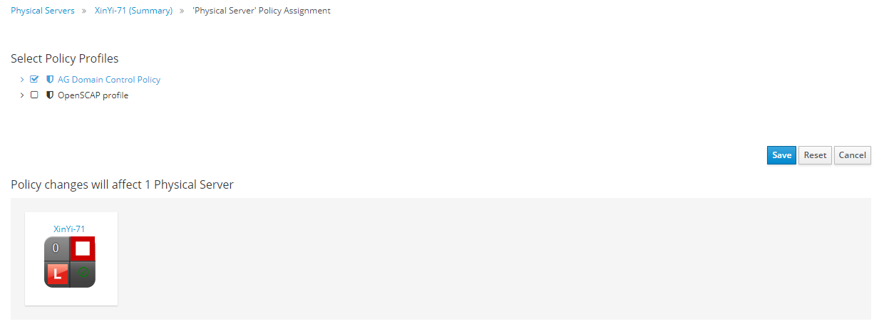

==== Assigning a new Policy Profile

You can assign policy profiles to physical infrastructure providers as shown below.

. Navigate to Compute → Physical Infrastructure → Providers and select **(Providers).**

. Select the provider that you wish assign to the policy profile.

. Click **(Policy)**, then click **(Manage Policies)**.

. Select the policy profile created

. Click *Save*.
