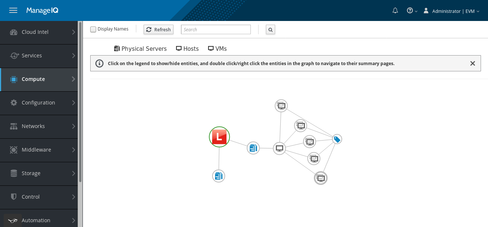

=== Using the Topology Widget for Physical Infrastructure Providers

The Physical Infrastructure Provider has the ability to highlight the relationship between virtual hosts and physical servers each host leverages. The topology view provides a graphical representation of these relationships, allowing the administrator to easily navigate between connected components. A screenshot of this view is shown below.

. Navigate to *Compute → Physical Infrastructure → Providers.*

. Select the Physical Infrastructure provider to be detailed.

. From the overview section, select *Topology*.

. In the Topology Page you can:

    .. Select *Physical Servers*, to hide/show all Physical Servers.

    .. Select *Hosts*, to hide/show all Hosts.

    .. Select *VMs*, to hide/show all VMs.

    .. Double click/right click the entities in the graph to navigate to the summary pages.
