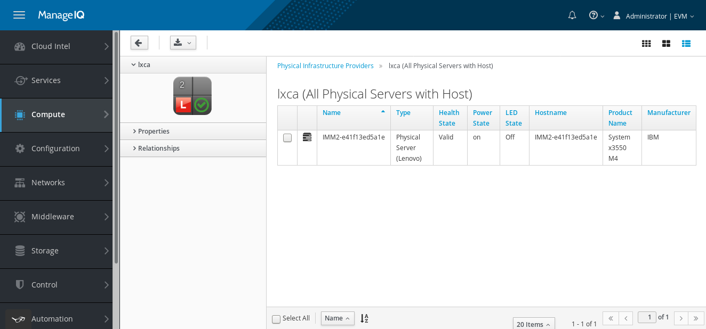

=== Viewing Host Relationships
You can view Host-associated Physical Servers that belong to the provider. In order to do that, you have to: 
[arabic]
. Navigate to **Compute > Physical Infrastructure > Providers**.
. Click a Provider from the list.
. Click **Physical Servers with Host button in Relationships section**.

You should see a list with the Host-associated Physical Servers as shown in the screenshot below.

